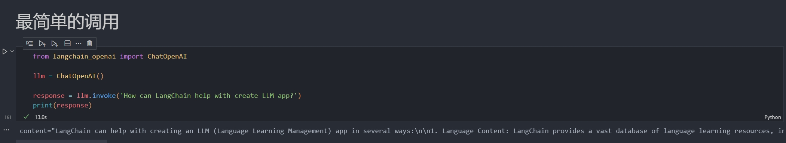

# LangChain 101: 01. Hello LangChain

`LangChain`在今年的1月8号发布了v0.1.0版本。之前也断断续续的学习了一遍，奈何学了忘，忘了学。今天开始重新整理一遍，顺便记录下来，顺手写一个【LangChain极简入门课】，供小白使用（大佬可以跳过）。
本教程默认以下前提：
- 使用Python版本的LangChain
- LLM使用OpenAI的gpt-3.5-turbo-1106
- LangChain发展非常迅速，虽然已经大版本v0.1了，后续版本肯定会继续迭代，为避免教程中代码失效。本教程统一使用版本 **0.1.2**

根据Langchain的[代码约定](https://github.com/langchain-ai/langchain/blob/v0.0.235/pyproject.toml#L14C1-L14C24)，Python版本 ">=3.8.1,<4.0"。

所有代码和教程开源在github：[https://github.com/keepwonder/langchain101](https://github.com/keepwonder/langchain101)

----

## LangChain 简介
LangChain 是一个由开源社区开发的工具库，它的目的是让开发者更加容易地构建和试验基于语言模型的应用程序。这个库专注于简化与语言模型交互的过程，提供了一系列的工具和接口，使得开发者可以快速集成复杂的语言理解和生成能力到他们自己的项目中。LangChain 不仅支持对话系统的构建，还包括更广泛的应用，如自动化摘要、信息提取和增强的搜索功能。


## OpenAI 简介
`OpenAI` 是语言模型领域的重要参与者之一，特别以其强大的生成预训练变换器（GPT）系列模型而闻名。其中，广为人知的 GPT-3.5 和 GPT-4 模型都是 OpenAI 的杰出产品。这些模型因其在理解和生成自然语言方面的高级能力而受到赞誉。`OpenAI` 提供了一个易于使用的 API，使开发者可以通过简单的接口调用来访问和利用这些先进的语言模型，从而在各种应用程序中实现语言理解和生成的功能。这种接入方式极大地简化了开发过程，让更多创新和实验成为可能，对推动语言模型在多种场景中的应用产生了深远影响。

## LangChain 与 OpenAI
`LangChain` 和 `OpenAI` 之间的关系主要体现在技术应用层面。`LangChain` 是一个独立的开源工具库，专门设计用于构建和实验基于语言模型的应用。它提供了一套工具和框架，帮助开发者更容易地利用语言模型来创建复杂的语言处理应用程序。

而 `OpenAI`，特别是通过其 `GPT `系列模型（如 `GPT-3` 和 `GPT-4`），提供了强大的语言理解和生成能力。`OpenAI` 的这些模型可以通过 API 访问，使得它们可以被集成到各种应用程序中，包括那些使用 LangChain 构建的应用。

简而言之，`OpenAI` 提供了先进的语言模型，而 `LangChain` 提供了一个框架和工具集，使得开发者可以更容易地将这些模型整合到他们自己的应用中。因此，虽然两者在组织上是独立的，但在技术层面上，LangChain 可以被看作是利用 OpenAI 提供的模型能力的一个工具或框架。


## 开发前的准备
在开始我们的第一个 `LangChain` 应用开发之前，我们需要做以下准备:

- python环境准备好
- 开发工具准备好，本地的话，就用 vscode + jupyter 插件就行了，当然其他工具 pycharm 之类，或者云开发环境都行，自己熟悉就好
- OpenAI API key

## 第一个 LangChain 应用

这个hello world程序，只有1行安装命令、2行加载环境变量代码 和 3行实际运行代码

### 安装
```shell
pip install langchain==0.1.2 openai
```

### 加载环境变量
```python
from dotenv import load_dotenv

load_dotenv()
```

### 代码
[Hell LangChain.ipynb](./Hello%20LangChain.ipynb)
```python
from langchain_openai import ChatOpenAI

llm = ChatOpenAI()

response = llm.invoke('How can LangChain help with create LLM app?')
print(response)
```

你应该能看到类似这样的输出：

```shell
content="LangChain can help with creating an LLM (Language Learning Management) app in several ways:\n\n1. Language Content: LangChain provides a vast database of language learning resources, including vocabulary lists, grammar explanations, audio files, and example sentences. These resources can be integrated into the LLM app to provide comprehensive language content for learners.\n\n2. Curriculum Design: LangChain offers curriculum design services, helping to structure and organize language learning materials in a logical and effective manner. This ensures that the app provides a structured learning experience for users.\n\n3. Progress Tracking: LangChain's platform allows for progress tracking and assessment. This feature can be incorporated into the LLM app, enabling learners to track their progress, identify areas of improvement, and receive personalized recommendations based on their performance.\n\n4. User Engagement: LangChain's platform includes interactive features such as quizzes, exercises, and games. These interactive elements can be integrated into the LLM app to engage users and make language learning more enjoyable and immersive.\n\n5. Customization: LangChain offers customization options, allowing the LLM app to be tailored to the specific needs and preferences of learners. This includes customization of the user interface, content selection, and learning pathways.\n\nOverall, LangChain can provide the necessary language content, curriculum design expertise, progress tracking capabilities, user engagement tools, and customization options to help create a comprehensive and effective LLM app."
```

拆解一下这个程序

1. 安装LangChain运行必要的python包，langchain和openai
```shell
pip install langchain==0.1.2 openai
```

2. 为了不明文显示Openai API key，我把API Key 放在了.env文件中，通过load_env把API key 加载到环境变量中。一次调用，后续多次使用。
```python
from dotenv import load_dotenv

load_dotenv()
```

3. 导入`ChatOpenAI`类，该类封装OpenAI的聊天模型。使用默认的初始化参数：`temperature`默认0.7， `model_name`默认`gpt-3.5-turbo`
```python
from langchain_openai import ChatOpenAI

llm = ChatOpenAI()
```

4. 使用 LangChain 完成对OpenAI GPT模型的第一次调用，打印出相应
```python
response = llm.invoke('How can LangChain help with create LLM app?')
print(response)
```

## 运行代码
在jupyter中，运行代码块，只需要按住Ctrl/Shift + Enter即可，非常方便。


## 总结
本节课程中，我们简单介绍了`LangChain`,`OpenAI`以及他们之间的关系，并完成了第一个`LangChain`hello world程序！

### 相关资料
1. [Python LangChain官方文档](https://python.langchain.com/docs/get_started/quickstart)