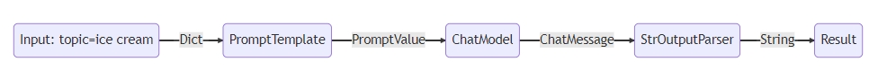

# LangChain 101: 01. LangChain解释性语言

`LangChain`在今年的1月8号发布了v0.1.0版本。之前也断断续续的学习了一遍，奈何学了忘，忘了学。今天开始重新整理一遍，顺便记录下来，顺手写一个【LangChain极简入门课】，供小白使用（大佬可以跳过）。
本教程默认以下前提：
- 使用Python版本的LangChain
- LLM使用OpenAI的gpt-3.5-turbo-1106
- LangChain发展非常迅速，虽然已经大版本v0.1了，后续版本肯定会继续迭代，为避免教程中代码失效。本教程统一使用版本 **0.1.2**

根据Langchain的[代码约定](https://github.com/langchain-ai/langchain/blob/v0.1.2/pyproject.toml#L11)，Python版本 ">=3.8.1,<4.0"。

所有代码和教程开源在github：[https://github.com/keepwonder/langchain101](https://github.com/keepwonder/langchain101)

----

## LCEL 简介
`LCEL` 全称 `LangChain Expression Language`，LangChain解释性语言，通过使用管道操作符的方式，将LangChain的各种组件组合在一起。通过实现`Runnable`接口，对外暴露统一的API调用，包括：
- invoke
- stream
- batch
- ainvoke
- astream
- abatch
- astream_log
- astream_events

以下是各个组件的输入类型和输出类型：

|**Component**|**Input Type**|**Output Type**|
|---|---|---|
|Prompt|Dictionary|PromptValue|
|ChatModel|Single string, list of chat messages or a PromptValue|ChatMessage|
|LLM|Single string, list of chat messages or a PromptValue|String|
|OutputParser|The output of an LLM or ChatModel|Depends on the parser|
|Retriever|Single string|List of Documents|
|Tool|Single string or dictionary, depending on the tool|Depends on the tool|

## 基本示例
[LCEL.ipynb](./LCEL.ipynb)

```python
# prompt + model + output parser

from langchain_core.prompts import ChatPromptTemplate
from langchain_core.output_parsers import StrOutputParser
from langchain_openai import ChatOpenAI

prompt = ChatPromptTemplate.from_template('Tell me a short joke about {topic}')
model = ChatOpenAI(model='gpt-3.5-turbo-1106')
output_parser = StrOutputParser()

chain = prompt | model | output_parser

chain.invoke({'topic':'ice cream'})
```

### 操作符 `|`
`|` 符号类似于 `unix` 管道运算符，它将不同组件链接在一起，将来自一个组件的输出作为输入提供给下一个组件。

在这个链中，用户输入被传递给提示模板，然后提示模板输出被传递给模型，然后模型输出被传递给输出解析器。我们分别看一下每个组件的作用

### 1. prompts
`prompt`是一个 `BasePromptTemplate`，这意味着它接受字典模板变量并生成一个 `PromptValue`。

```python
prompt_value = prompt.invoke({"topic": "ice cream"})
prompt_value
```

```shell
ChatPromptValue(messages=[HumanMessage(content='Tell me a short joke about ice cream')])
```

```python
prompt_value.to_messages()
```

```shell
[HumanMessage(content='tell me a short joke about ice cream')]
```

```python
prompt_value.to_string()
```

```shell
'Human: tell me a short joke about ice cream'
```

### 2.Model
`PromptValue` 被传递给 `model`

```python
message = model.invoke(prompt_value)
message
```
```shell
AIMessage(content='Why did the ice cream go to therapy? Because it had too many sprinkles of anxiety!')
```

### 3.Output parse
最后我们把模型 `model` 的输出传递给输出解析器 `output_parser`,`StrOutputParser`把输入转换成一个字符串
```python
output_parser.invoke(message)
```

```shell
'Why did the ice cream go to therapy? Because it had too many sprinkles of anxiety!'
```

### 4.整个流程
1. 我们将`{"topic": "ice cream"}`作为输入传入
2. `prompt`组件接受用户输入，用于构造 `PromptValue`。
3. `model`组件接受生成的提示词，并传递到 OpenAI LLM 模型进行评估。模型生成的输出是一个 `ChatMessage` 对象。
4. 最后，`output_parser` 组件接受一个 `ChatMessage`，并通过invoke方法将其转换为一个Python字符串返回。




## 总结
本节课程中，我们简单介绍了`LCEL`, 并基于一个最简单的示例说明了`LCEL`是如何一步一步调用的。

### 相关资料
1. [LangChain Expression Language](https://python.langchain.com/docs/expression_language/)