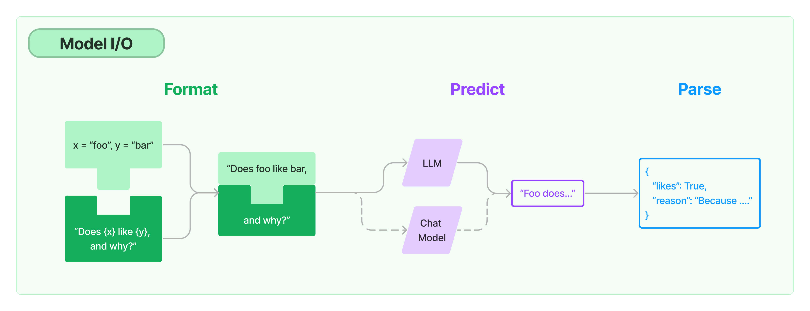

# LangChain 101: 04.输出解析器

`LangChain`在今年的1月8号发布了v0.1.0版本。之前也断断续续的学习了一遍，奈何学了忘，忘了学。今天开始重新整理一遍，顺便记录下来，顺手写一个【LangChain极简入门课】，供小白使用（大佬可以跳过）。
本教程默认以下前提：
- 使用Python版本的LangChain
- LLM使用OpenAI的gpt-3.5-turbo-1106
- LangChain发展非常迅速，虽然已经大版本v0.1了，后续版本肯定会继续迭代，为避免教程中代码失效。本教程统一使用版本 **0.1.2**

根据Langchain的[代码约定](https://github.com/langchain-ai/langchain/blob/v0.0.235/pyproject.toml#L14C1-L14C24)，Python版本 ">=3.8.1,<4.0"。

所有代码和教程开源在github：[https://github.com/keepwonder/langchain101](https://github.com/keepwonder/langchain101)

----


## Model I/O
今天我们开始介绍Model I/O模块，如上图所示，Model I/O模块包含3部分， 左边绿色部分  Format，中间紫色部分 Predict，右边蓝色部分 Parse。而这三部分分别对应LangChain中最基础也是最重要的三个概念

|输入|处理|输出|
|----|----|---|
|Prompts|LLMs / Chat Models|Output Parsers|

今天我们要介绍的是输出部分，也就是输出解析器（Output Parsers）。

## 简介
LLM的输出为文本，但在程序中除了显示文本，可能希望获得更结构化的数据。这就是输出解析器（Output Parsers）的用武之地。

`LangChain` 为输出解析器提供了基础类 `BaseOutputParser`。不同的输出解析器都继承自该类。它们需要实现以下两个函数：
- **get_format_instructions**：返回指令指定LLM的输出该如何格式化，该函数在实现类中必须重写。基类中的函数实现如下：
```python
def get_format_instructions(self) -> str:
        """Instructions on how the LLM output should be formatted."""
     raise NotImplementedError
```
- **parse**：解析LLM的输出文本为特定的结构。函数签名如下：
```python
@abstractmethod
def parse(self, text: str) -> T:
    """Parse a single string model output into some structure.

    Args:
        text: String output of a language model.

    Returns:
        Structured output.
    """
```

`BaseOutputParser` 还提供了如下函数供重载：
**parse_with_prompt**：基于提示词上下文解析LLM的输出文本为特定结构。该函数在基类中的实现为：
```python
def parse_with_prompt(self, completion: str, prompt: PromptValue) -> Any:
    """Parse the output of an LLM call with the input prompt for context.

    The prompt is largely provided in the event the OutputParser wants
    to retry or fix the output in some way, and needs information from
    the prompt to do so.

    Args:
        completion: String output of a language model.
        prompt: Input PromptValue.

    Returns:
        Structured output
    """
    return self.parse(completion)
```

## LangChain支持的输出解析器
LangChain框架提供了一系列解析器实现来满足应用在不同功能场景中的需求。它们包括且不局限于如下解析器：
- CSV parser
- Datetime parser
- Enum parser
- JSON parser
- OpenAI Functions
- OpenAI Tools
- Output-fixing parser
- Pandas DataFrame Parser
- Pydantic parser
- Retry parser
- Structured output parser
- XML parser
- YAML parser

本讲介绍具有代表性的两款解析器的使用。

### CSV parser

CSV parser 会返回一个逗号分割的列表。

```python
from langchain.output_parsers import CommaSeparatedListOutputParser

output_parser = CommaSeparatedListOutputParser()

output_parser.parse('red, green, blue')
```

你应该能看到如下输出：

```shell
['red', 'green', 'blue']
```

### Structured Output Parser

当我们想要类似JSON数据结构，包含多个字段时，可以使用这个输出解析器。该解析器可以生成指令帮助LLM返回结构化数据文本，同时完成文本到结构化数据的解析工作。示例代码如下：

```python

from langchain.output_parsers import ResponseSchema, StructuredOutputParser
from langchain.prompts import PromptTemplate
from langchain_openai import ChatOpenAI

# 定义响应的结构(JSON)，两个字段 answer和source。
response_schemas = [
    ResponseSchema(name="answer", description="answer to the user's question"),
    ResponseSchema(
        name="source",
        description="source used to answer the user's question, should be a website.",
    ),
]
output_parser = StructuredOutputParser.from_response_schemas(response_schemas)

# 获取响应格式化的指令
format_instructions = output_parser.get_format_instructions()

# partial_variables允许在代码中预填充提示此模版的部分变量。这类似于接口，抽象类之间的关系
prompt = PromptTemplate(
    template="answer the users question as best as possible.\n{format_instructions}\n{question}",
    input_variables=["question"],
    partial_variables={"format_instructions": format_instructions}
)

model = OpenAI(temperature=0)
response = prompt.format_prompt(question="what's the capital of France?")

model = ChatOpenAI(temperature=0)
chain = prompt | model | output_parser

chain.invoke({"question": "what's the capital of france?"})
```

你应该期望能看到如下输出：
```shell
{'answer': 'The capital of France is Paris.',
 'source': 'https://en.wikipedia.org/wiki/Paris'}
```

## 总结
本节课程中，我们学习了什么是 `输出解析器` ，LangChain支持的常见解析器，以及如何使用常见的两款解析器 `CSV parser` 和 `Structured output parser`。

### 相关文档
1. [Output ParserS官方文档](https://python.langchain.com/docs/modules/model_io/output_parsers/) 
2. [Partial - Prompt Templates](https://python.langchain.com/docs/modules/model_io/prompts/partial)