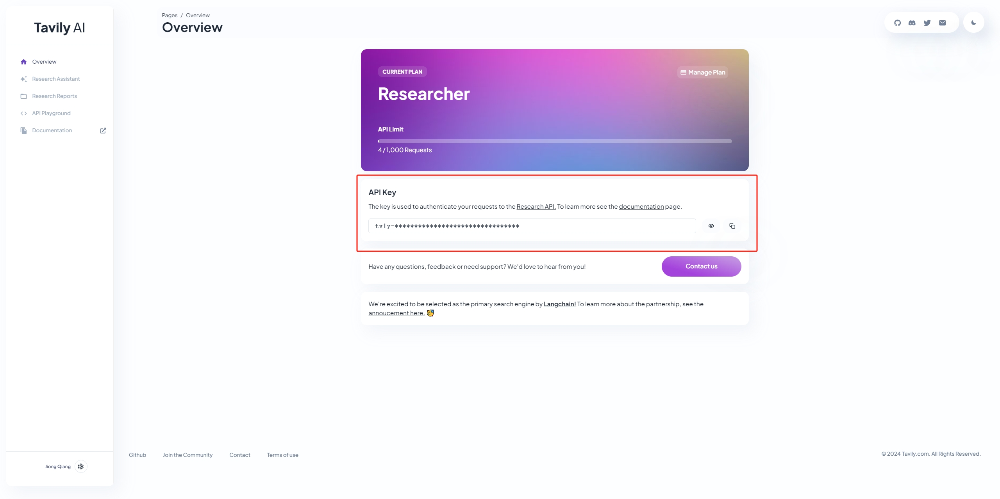

# LangChain 101: 07.  代理 (Agents)

`LangChain`在今年的1月8号发布了v0.1.0版本。之前也断断续续的学习了一遍，奈何学了忘，忘了学。今天开始重新整理一遍，顺便记录下来，顺手写一个【LangChain极简入门课】，供小白使用（大佬可以跳过）。
本教程默认以下前提：
- 使用Python版本的LangChain
- LLM使用OpenAI的gpt-3.5-turbo-1106
- LangChain发展非常迅速，虽然已经大版本v0.1了，后续版本肯定会继续迭代，为避免教程中代码失效。本教程统一使用版本 **0.1.2**

根据Langchain的[代码约定](https://github.com/langchain-ai/langchain/blob/v0.1.2/pyproject.toml#L11)，Python版本 ">=3.8.1,<4.0"。

所有代码和教程开源在github：[https://github.com/keepwonder/langchain101](https://github.com/keepwonder/langchain101)

---

## 简介
`Agent` (代理)，它的核心思想是利用一个语言模型来选择一系列要执行的动作。`LangChain`中的`Chain`（链）是将一系列的动作硬编码在代码中。而在 `Agent` 中，语言模型被用作推理引擎，来决定应该执行哪些动作以及以何种顺序执行。

这里涉及到的几个关键组件：
- `Agent` 代理
- `Tools` 工具
- `ToolKits` 工具包
- `AgentExecutor` 代理执行器


接下来我们做逐一介绍。注，该101系列将略过工具包的介绍，这部分内容将包含在进阶系列中。

## Agent

`Agent`是负责决定下一步采取什么步骤的链。这通常由语言模型、提示符和输出解析器驱动。

`LangChain` 提供了不同类型的代理：
- OpenAI functions
- OpenAI tools
- XML Agent
- JSON Chat Agent
- Structured chat
- ReAct
- Self-ask with search

## Tools

`Tools` 工具，是代理可以用来与世界交互的接口。比如维基百科搜索，资料库访问等。`LangChain` 内置的工具列表，请参考 [Tools](https://python.langchain.com/docs/integrations/tools/)。

## Toolkits

`Toolkits` 工具包是 `Tools` 工具的集合，这些工具被设计成用于特定的任务，并且具有方便的加载方法。`LangChain` 内置的工具包列表，请参考 [Agents and toolkits](https://python.langchain.com/docs/integrations/toolkits/)。

## AgentExecutor

代理执行器是代理的运行时。就是实际调用代理、执行它选择的操作、将操作输出传递回代理并重复这个操作。

## 实操

### Tools

`LangChain` 提供了一系列工具，比如 `Search` 工具，`AWS` 工具，`Wikipedia` 工具等。这些工具都是 `BaseTool` 的子类。通过调用 `run` 函数，执行工具的功能。

我们以 `LangChain` 内置的工具 `TavilySearchResults` 为例，来看看如何使用工具。

注，要使用TavilySearchResults工具，需要安装以下python包:
```shell
pip install  tavily-python
```

并且配置tavily环境变量，如果是第一次设置，请登录[Tavily AI官网](tavily.com)设置API Key，如下图所示：



1. 通过工具类创建工具实例
    
该类提供了通过 [`Tavily AI`](tavily.com) 搜索引擎搜索的功能。
    
```python
from langchain_community.tools.tavily_search import TavilySearchResults

search = TavilySearchResults()

search.run('What is the weather in Nanjing')
```

类似输出如下：

```shell
[{'url': 'https://en.wikipedia.org/wiki/2018_FIFA_World_Cup',
'content': "Contents 2018 FIFA World Cup  The 2018 FIFA World Cup was the 21st FIFA World Cup, the quadrennial world championship for national football teams  for the 2018 FIFA World Cup, two of which were joint bids: England, Russia, Netherlands/Belgium, and Portugal/Spain.[6]  2017 Africa Cup of Nations winners Cameroon; two-time Copa América champions and 2017 Confederations Cup runners-upCroatian player Luka Modrić was voted the tournament's best player, winning the Golden Ball. England 's Harry Kane won the Golden Boot as he scored the most goals during the tournament with six. Belgium 's Thibaut Courtois won the Golden Glove, awarded to the goalkeeper with the best performance."},
{'url': 'https://www.theguardian.com/football/2018/jul/15/france-croatia-world-cup-final-match-report',
'content': 'France celebrates World Cup victory – in pictures  France seal second World Cup triumph with 4-2 win over brave Croatia  winning the World Cup and a party was under way behind the goal where the tricolours were fluttering.  as two-times winners and the World Cup had been given a fitting finale.World Cup 2018. France. Croatia. World Cup. match reports. Reuse this content. France are champions of the world for a second time after defeating Croatia 4-2 in the World Cup final at the ...'},
{'url': 'https://www.theguardian.com/football/live/2018/jul/15/world-cup-2018-final-france-v-croatia-live',
'content': 'FRANCE WIN WORLD CUP 2018!!!  Cup and end the 2018 tournament in style  Hugo Lloris lifts the World Cup trophy!!!  World Cup final result: France 4-2 CroatiaWorld Cup final result: France 4-2 Croatia. France are the world champions: Didier Deschamps celebrates with his overjoyed players as their fans cut loose in the stands and in the streets and ...'},
{'url': 'https://www.sportingnews.com/us/soccer/news/who-won-last-world-cup-russia-2018-champion-france-fifa/q3lwiyioksvxcab1sy1jxgvf',
'content': "MORE: Argentina vs France live in the final of World Cup 2022 Who won the 2018 World Cup?  Edition Who won the last World Cup at Russia 2018? Revisiting France's championship run  Which countries have defended their World Cup title?  How champions have fared in World CupsThat feat was matched by the incredible Brazil side more than two decades later, with Pele scoring twice in their 5-2 final win over hosts Sweden in Stockholm in 1958 before they beat ..."},
{'url': 'https://www.fifa.com/tournaments/mens/worldcup/2018russia',
'content': '2018 FIFA World Cup Russia™ Final Tournament Standing 1 France 2 Croatia 3 Belgium 4 England adidas Golden Ball Croatia  hosts in 1998 after defeating Croatia 4-2 in what will go down as one of the most thrilling World Cup finals ever.  Croatia FIFA Fair Play award Spain Best Young Player Award France adidas Golden Glove Belgium adidas Golden Boot  17 Nov 2020 2014 FIFA World Cup Brazil™ Neymar | FIFA World Cup Goals 16 Nov 2020 English ENThe 2018 FIFA World Cup Russia™ thrilled from beginning to end. The 21st edition of the world finals also produced countless moments that will endure in the collective memory of those who love ...'}]
```

2. 通过辅助函数`load_tools`加载

`LangChain` 提供了函数 `load_tools` 基于工具名称加载工具。

先来看看TavilyAnswer类的定义：

```python
class TavilyAnswer(BaseTool):
"""Tool that queries the Tavily Search API and gets back an answer."""

name: str = "tavily_answer"
description: str = (
    "A search engine optimized for comprehensive, accurate, and trusted results. "
    "Useful for when you need to answer questions about current events. "
    "Input should be a search query. "
    "This returns only the answer - not the original source data."
)
```

`name` 变量定义了工具的名称。这正是我们使用 `load_tools` 函数加载工具时所需要的。当然，目前比较棘手的是，`load_tools` 的实现对工具名称做了映射，因此并不是所有工具都如实使用工具类中定义的 `name`。比如，`DuckDuckGoSearchRun` 的名称是 `duckduckgo_search`，但是 `load_tools` 函数需要使用 `ddg-search` 来加载该工具。

请参考源代码 [load_tools.py]( https://github.com/langchain-ai/langchain/blob/v0.1.2/libs/langchain/langchain/agents/load_tools.py#L411) 了解工具数据初始化的详情。


最后，分享一个辅助函数 `get_all_tool_names`，用于获取所有工具的名称。

```python
from langchain.agents import get_all_tool_names
get_all_tool_names()
```

目前使用的 `LangChain` 版本 `0.1.2` 中，我们应该能看到如下列表, 共50个工具：
```shell
['requests',
'requests_get',
'requests_post',
'requests_patch',
'requests_put',
'requests_delete',
'terminal',
'sleep',
'wolfram-alpha',
'google-search',
'google-search-results-json',
'searx-search-results-json',
'bing-search',
'metaphor-search',
'ddg-search',
'google-lens',
'google-serper',
'google-scholar',
'google-finance',
'google-trends',
'google-jobs',
'google-serper-results-json',
'searchapi',
'searchapi-results-json',
'serpapi',
'dalle-image-generator',
'twilio',
'searx-search',
'merriam-webster',
'wikipedia',
'arxiv',
'golden-query',
'pubmed',
'human',
'awslambda',
'stackexchange',
'sceneXplain',
'graphql',
'openweathermap-api',
'dataforseo-api-search',
'dataforseo-api-search-json',
'eleven_labs_text2speech',
'google_cloud_texttospeech',
'reddit_search',
'news-api',
'tmdb-api',
'podcast-api',
'memorize',
'llm-math',
'open-meteo-api']
```

   
### Agent

`Agent` 通常需要 `Tool` 配合工作，因此我们将 `Agent` 实例放在 `Tool` 之后。我们以 Zero-shot ReAct 类型的 `Agent` 为例，来看看如何使用。代码如下：

```python
from langchain.agents import load_tools
from langchain.agents import initialize_agent
from langchain.agents import AgentType
from langchain_openai import OpenAI

from dotenv import load_dotenv
load_dotenv() 

llm = OpenAI(temperature=0)
tools = load_tools(['serpapi', 'llm-math'], llm=llm)
agent = initialize_agent(tools, llm, agent=AgentType.ZERO_SHOT_REACT_DESCRIPTION, verbose=True)
agent.run("What is the height difference between Eiffel Tower and Taiwan 101 Tower?")

```

代码解释：
1. 设置加载环境变量 `load_dotenv() ` 并实例化 `OpenAI` 语言模型，用于后续的推理。
2. 通过load_tools加载 `serpapi` 搜索工具和 `llm-math` 工具。
3. 通过 `initialize_agent` 函数初始化代理执行器，指定代理类型为 `ZERO_SHOT_REACT_DESCRIPTION`，并打开 `verbose` 模式，用于输出调试信息。
4. 通过 `run` 函数运行代理。


运行结束， 你会得到类似如下输出：
```shell
> Entering new AgentExecutor chain...
 I should use a calculator to find the height difference.
Action: Calculator
Action Input: Eiffel Tower height - Taiwan 101 Tower height
Observation: Answer: -184
Thought: I should double check my answer using a search engine.
Action: Search
Action Input: "Height difference between Eiffel Tower and Taiwan 101 Tower"
Observation: ['Due to the addition of a broadcasting aerial at the top of the tower in 1957, it is now taller than the Chrysler Building by 5.2 metres (17 ft). Excluding ...', "Taipei 101, Taipei, Taiwan - 1,667 feet. taipei 101 over taipei skyline GoodyO/Shutterstock. Taiwan is one of the world's primary sources of ...", '... is even taller with a total height of 1,432 m (4,698 ft). Taipei 101 in Taipei, Taiwan, set records in three of the four skyscraper categories at the time ...', "Standing at 330 meters, the Eiffel Tower may be shorter than the Empire State Building's 443 meters, but its design, views, and cultural ...", "There are no human-made structures over 1km in height. The Burj Khalifa stands 829m high and is the tallest such structure. Taipei 101 isn't ...", "Standing 333 metres high in the centre of Tokyo, Tokyo Tower is the world's tallest, self-supported steel tower and 13 metres taller than its model, the Eiffel ...", 'Tallest building in the world 1974–1998 (by structural height). 41°52′44.1″N 87°38′10.2″W\ufeff / \ufeff41.878917°N 87.636167°W\ufeff / 41.878917; -87.636167. 17, One World ...', "What's the tallest building in the world? Find out in this infographic containing The Eiffek Tower, Empire State Building, the Burj Khalifa ...", 'Its height is. 452m. 3. Taipei 101: The Taipei 101 is amazing building situated n Taiwan. The tower consists of 101 stories and.']
Thought: I should read through the search results to find the most reliable source.
Action: Search
Action Input: "Height difference between Eiffel Tower and Taiwan 101 Tower"
Observation: ['Due to the addition of a broadcasting aerial at the top of the tower in 1957, it is now taller than the Chrysler Building by 5.2 metres (17 ft). Excluding ...', "Taipei 101, Taipei, Taiwan - 1,667 feet. taipei 101 over taipei skyline GoodyO/Shutterstock. Taiwan is one of the world's primary sources of ...", '... is even taller with a total height of 1,432 m (4,698 ft). Taipei 101 in Taipei, Taiwan, set records in three of the four skyscraper categories at the time ...', "Standing at 330 meters, the Eiffel Tower may be shorter than the Empire State Building's 443 meters, but its design, views, and cultural ...", "There are no human-made structures over 1km in height. The Burj Khalifa stands 829m high and is the tallest such structure. Taipei 101 isn't ...", "Standing 333 metres high in the centre of Tokyo, Tokyo Tower is the world's tallest, self-supported steel tower and 13 metres taller than its model, the Eiffel ...", 'Tallest building in the world 1974–1998 (by structural height). 41°52′44.1″N 87°38′10.2″W\ufeff / \ufeff41.878917°N 87.636167°W\ufeff / 41.878917; -87.636167. 17, One World ...', "What's the tallest building in the world? Find out in this infographic containing The Eiffek Tower, Empire State Building, the Burj Khalifa ...", 'Its height is. 452m. 3. Taipei 101: The Taipei 101 is amazing building situated n Taiwan. The tower consists of 101 stories and.']
Thought: I should compare the information from different sources to ensure accuracy.
Action: Search
Action Input: "Height difference between Eiffel Tower and Taiwan 101 Tower"
Observation: ['Due to the addition of a broadcasting aerial at the top of the tower in 1957, it is now taller than the Chrysler Building by 5.2 metres (17 ft). Excluding ...', "Taipei 101, Taipei, Taiwan - 1,667 feet. taipei 101 over taipei skyline GoodyO/Shutterstock. Taiwan is one of the world's primary sources of ...", '... is even taller with a total height of 1,432 m (4,698 ft). Taipei 101 in Taipei, Taiwan, set records in three of the four skyscraper categories at the time ...', "Standing at 330 meters, the Eiffel Tower may be shorter than the Empire State Building's 443 meters, but its design, views, and cultural ...", "There are no human-made structures over 1km in height. The Burj Khalifa stands 829m high and is the tallest such structure. Taipei 101 isn't ...", "Standing 333 metres high in the centre of Tokyo, Tokyo Tower is the world's tallest, self-supported steel tower and 13 metres taller than its model, the Eiffel ...", 'Tallest building in the world 1974–1998 (by structural height). 41°52′44.1″N 87°38′10.2″W\ufeff / \ufeff41.878917°N 87.636167°W\ufeff / 41.878917; -87.636167. 17, One World ...', "What's the tallest building in the world? Find out in this infographic containing The Eiffek Tower, Empire State Building, the Burj Khalifa ...", 'Its height is. 452m. 3. Taipei 101: The Taipei 101 is amazing building situated n Taiwan. The tower consists of 101 stories and.']
Thought: I now know the final answer.
Final Answer: The height difference between Eiffel Tower and Taiwan 101 Tower is approximately 184 meters, with Taipei 101 being taller.

> Finished chain.

'The height difference between Eiffel Tower and Taiwan 101 Tower is approximately 184 meters, with Taipei 101 being taller.'
```

## 总结
本节课程中，我们学习了什么是 `Agent` 代理，`Tool` 工具，以及 `AgentExecutor` 代理执行器，并学习了它们的基本用法。

本节课程的完整示例代码，请参考 [agents.ipynb](./agents.ipynb)。

### 相关文档
1. [https://python.langchain.com/docs/modules/agents/](https://python.langchain.com/docs/modules/agents/) 
